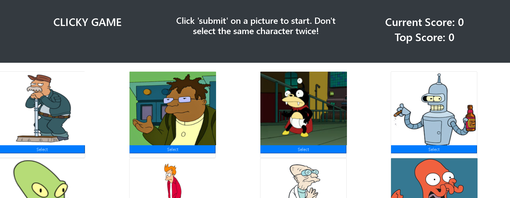

# Clicky-Game-React

application: https://jmerges.github.io/Clicky-Game-React/  
 
James Merges  
email: jamesmerges1@gmail.com  
github: https://github.com/jmerges  
linkedin: https://www.linkedin.com/in/james-merges-b938401b7/  

## Description
I developed this little game to practice using React, a front-end framework.
 The game uses React components to generate the tiles and re-order them each
 time a selection is made. This particular app uses a state variable to store
 the game's variables. React is a great framework and very straightforward to
 use.

## Preview
